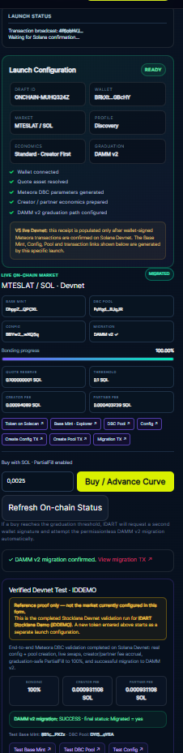
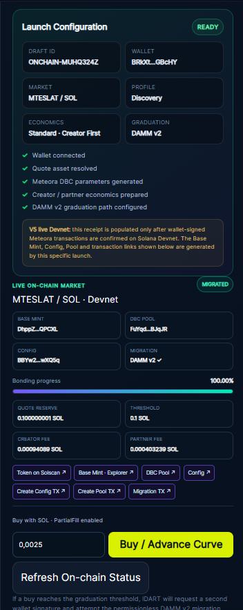

# Post-Submission Browser Validation

> **Development update — September 26, 2026.**
>
> This document records improvements completed after the Stocklana submission deadline.  
> The original `SUBMISSION_SNAPSHOT.md` should remain unchanged as the historical snapshot of the submitted build.

## Browser-native end-to-end Devnet flow

After submission, the IDART Fun Launchpad browser flow was extended from configuration/export mode to real wallet-signed Meteora DBC execution on Solana Devnet.

The live demo has now successfully completed the following flow directly from the website, without using the PowerShell/CLI flow that was used for the original validation:

1. Connect a Solana wallet.
2. Build a Meteora DBC configuration in the browser.
3. Sign the DBC config transaction in the wallet.
4. Create the launch token and DBC virtual pool.
5. Read the newly created market back from Solana.
6. Execute real browser-based buys against the bonding curve.
7. Read live bonding progress, quote reserve and accrued fees on-chain.
8. Use graduation-safe `PartialFill` buys near the curve threshold.
9. Reach 100% bonding.
10. Execute and confirm migration to Meteora DAMM v2.

## Validated configurable economics

The browser test used the **Standard · Creator First** economics profile.

The live on-chain fee display showed a creator/partner fee allocation consistent with the configured **70% Creator / 30% Partner** split. This demonstrates that the economics selector is not only a UI label: the selected creator trading-fee percentage is passed into the DBC configuration used for the market.

## What the screenshots show

### Full browser flow

The full launch panel shows the wallet-signed launch configuration, the live on-chain market, 100% bonding, and confirmed DAMM v2 migration.

### Final migrated market state

The focused view shows:

- a newly created Devnet market launched from the website;
- `100.00%` bonding progress;
- quote reserve at the graduation threshold;
- creator and partner fees read on-chain;
- migration status `DAMM v2`;
- final `MIGRATED` state;
- links generated by the application for the token, Base Mint, DBC Pool, Config, creation transactions and migration transaction.

## Original validation vs. browser validation

The repository's earlier Stocklana proof documented the first end-to-end Meteora DBC test performed with the Meteora Invent/SDK workflow.

This update is separate and stronger from a product-UX perspective: a user can now initiate the core Devnet launch lifecycle from the public IDART Launchpad interface using a connected wallet.

The older proof is intentionally retained because it documents the state available around the submission deadline. This file documents continued development after submission.

## Live demo

https://launchpad.idartdex.xyz/launch/

## Notes

- Devnet SOL is required for live Devnet testing.
- The current browser-tested quote asset is SOL.
- xStocks / PreStocks quote-asset execution is the next integration step; those mainnet assets should not be presented as Devnet mints.
- Mainnet execution remains a separate rollout step and should only be enabled after quote-mint compatibility, Token-2022/token-badge requirements, wallet warnings and transaction simulation have been validated.
