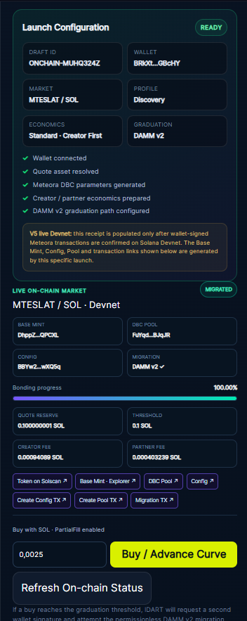

# Post-Submission Browser Validation

> **Development update — October 2026.**
>
> This document records product progress completed after the Stocklana submission deadline.
>
> The original `SUBMISSION_SNAPSHOT.md` remains unchanged as the historical snapshot of the submitted build.

---

## Browser-Native End-to-End Devnet Flow

After submission, the IDART FUN browser flow was extended from configuration/export mode to real wallet-signed Meteora DBC execution on Solana Devnet.

The live product successfully completed the following flow directly from the website:

1. Connect a Solana wallet.
2. Build a Meteora DBC configuration in the browser.
3. Sign the DBC config transaction in the wallet.
4. Create the launch token and DBC virtual pool.
5. Read the newly created market back from Solana.
6. Execute real browser-based buys against the bonding curve.
7. Read live bonding progress, quote reserve and accrued fees on-chain.
8. Use graduation-safe `PartialFill` buys near the curve threshold.
9. Reach 100% bonding.
10. Execute and confirm migration to Meteora DAMM v2.

---

## Browser Devnet Proof

The browser validation reached a final migrated market state from the public launch interface.

The focused validation view demonstrates:

- a newly created Devnet market launched from the website;
- `100.00%` bonding progress;
- quote reserve at the graduation threshold;
- creator and partner fees read on-chain;
- migration status `DAMM v2`;
- final `MIGRATED` state;
- application-generated links for the token, Base Mint, DBC Pool, Config, creation transactions and migration transaction.

---

## Mainnet Browser Lifecycle Validation

The product subsequently completed a real Mainnet lifecycle using real SOL.

Validated Mainnet flow:

`Create → Meteora DBC → Buy / Trade → 100% Bonding → DAMM v2`

The Mainnet MEMET validation market is publicly documented in:

[`MAINNET_VALIDATION.md`](./MAINNET_VALIDATION.md)

and is also exposed through the public Launch validation archive.

---

## Discovery Markets

The public product now includes a Discovery Markets layer at:

https://idartfun.xyz/token/

The interface includes:

- market-status filtering;
- quote-asset filtering;
- search and sorting;
- card / table views;
- Mainnet and Devnet reference markets;
- xStocks, PreStocks, USDC and Solana-token quote-route visibility.

---

## Mainnet Market Detail

The Mainnet MEMET validation market now has a dedicated market-detail page:

https://idartfun.xyz/token/memet/

The page combines:

- token identity and metadata;
- launch setup;
- Market Profile;
- Economics mode;
- DBC → DAMM v2 lifecycle information;
- official GeckoTerminal market chart;
- Jupiter embedded trading interface;
- public fee / claim-status surfaces.

This page is the reference implementation for the future dynamic `/token/<mint>` market-detail system.

---

## Quote Asset Registry

The public launch interface now includes a broader multi-asset Quote Asset Registry.

Current product surfaces include:

- SOL;
- USDC;
- compatible Solana-token routes;
- **1,274+ xStocks**;
- **8 PreStocks**.

The registry inspects public asset metadata and on-chain mint characteristics so IDART can expose compatibility-aware quote-market routes.

---

## xStocks Mainnet Compatibility Validation

The xStock quote-market path has been validated using real **AAPLx** Mainnet state.

Validation result:

- AAPLx Token-2022 mint resolved;
- Meteora TokenBadge resolved;
- IDART exact DBC config simulation: **PASS**;
- fresh AAPLx `createPool` builder: **PASS**;
- fresh AAPLx Mainnet simulation: **PASS**;
- units consumed: `111031`;
- diagnostic cost: `0 SOL`;
- no wallet signature requested;
- no transaction broadcast.

This provides a Mainnet compatibility proof for the IDART xStock quote path without requiring additional paid Mainnet testing.

---

## Market Design & Economics

The current browser product exposes three Market Profiles:

- **⚡ Lightning** — `28 → 300 SOL`
- **⚖️ Smooth Graduation** — `35 → 350 SOL`
- **📈 Scale Up** — `40 → 450 SOL`

and three Economics modes:

- **Creator First · Standard** — `60 / 10 / 30`
- **All Win · Balanced** — `35 / 35 / 30`
- **Holder Rewards · Community** — `10 / 60 / 30`

The public trading-fee reference remains `2.50%`.

---

## Original Validation vs. Continued Product Development

The repository's original Stocklana proof is intentionally preserved.

This document records the additional product layers completed afterward:

- browser-native Devnet launch lifecycle;
- real Mainnet DBC → DAMM v2 lifecycle;
- Discovery Markets;
- Mainnet market-detail experience;
- multi-asset Quote Asset Registry;
- xStocks Mainnet compatibility validation;
- updated Market Profiles and Economics;
- Builders API preview.

These additions are documented as **Post-Submission Progress** rather than retroactively presented as part of the original deadline build.

---

## Live Product

https://idartfun.xyz/

## Launch

https://idartfun.xyz/launch/

## Discovery Markets

https://idartfun.xyz/token/

---

# IDART FUN

## Design the Market. Launch the Asse
