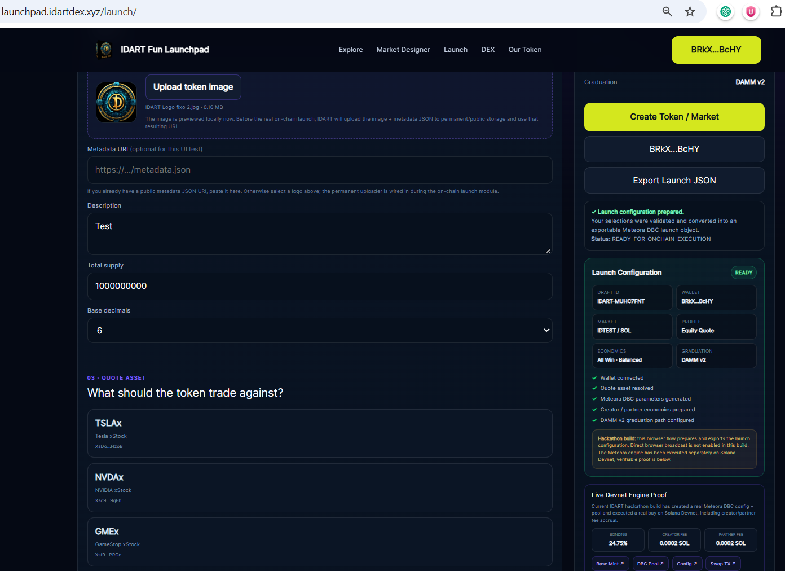
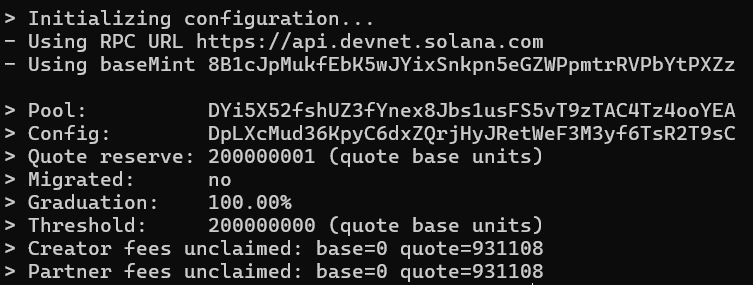
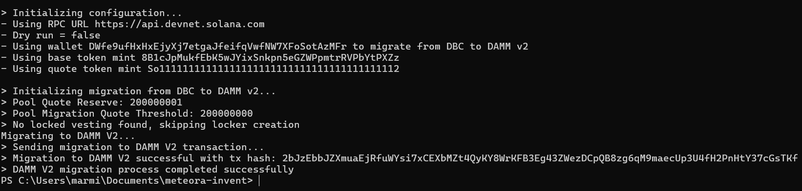
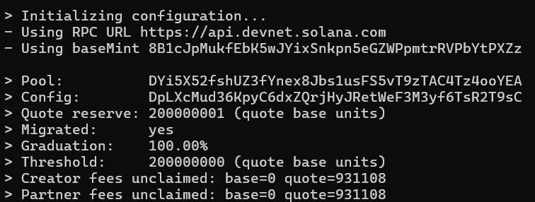

# IDART Fun Launchpad

**Design the market. Launch the asset.**

IDART Fun Launchpad is a Solana-native market-design launchpad built around **Meteora Dynamic Bonding Curve (DBC)**.

Rather than exposing creators to low-level market configuration, IDART turns configurable launch mechanics into a simple product flow: choose the asset, quote market, market profile, economics model, and graduation strategy.

## Live Demo

**https://launchpad.idartdex.xyz**

---

## Current Status

The project now has two distinct validation milestones:

### 1. Stocklana submission-deadline validation

At the Stocklana submission deadline, the browser interface supported wallet connection, token/market configuration, quote-asset selection, market profiles, economics modes, and exportable launch configuration generation.

The underlying Meteora DBC engine had already been validated **end-to-end on Solana Devnet** through the Meteora Invent/SDK workflow:

- real DBC config creation
- real token / virtual pool creation
- real DBC swaps
- separate creator and partner fee accrual
- graduation-safe final buy using `swapQuote2 + swap2 + SwapMode.PartialFill`
- 100% bonding-curve graduation
- successful migration to **Meteora DAMM v2**

The historical state at submission time is preserved in [`SUBMISSION_SNAPSHOT.md`](SUBMISSION_SNAPSHOT.md).

### 2. Browser-native on-chain validation — post-submission update

**September 26, 2026:** continued development after the Stocklana submission deadline.

The public IDART Fun Launchpad has now completed the same core lifecycle **directly from the browser using wallet-signed Solana Devnet transactions**:

**Connect Wallet → Create DBC Config → Create Token / Pool → Buy → Read Live Bonding Progress → PartialFill → 100% Bonding → Migrate to DAMM v2**

This second validation was completed without relying on the PowerShell/CLI execution path used for the original proof.

The browser flow now provides:

- real wallet-signed DBC config creation
- real token mint and virtual-pool creation
- application-generated Base Mint, DBC Pool, Config and transaction links
- browser-based DBC buys
- live bonding progress read from Solana
- live quote reserve and migration threshold
- live creator / partner fee accrual
- graduation-safe `PartialFill`
- 100% bonding
- browser-initiated DAMM v2 migration
- final `MIGRATED` market state

The browser test also validated the **Creator First** economics profile. The final displayed fee accrual was:

- Creator: `0.00094089 SOL`
- Partner: `0.000403239 SOL`

That is approximately a **70% Creator / 30% Partner** allocation, matching the economics profile selected before launch.

See [`POST_SUBMISSION_BROWSER_VALIDATION.md`](POST_SUBMISSION_BROWSER_VALIDATION.md) for the post-submission validation notes.

---

## Interface

The launch interface turns Meteora DBC configuration into a guided market-design flow while keeping wallet approval under the user's control.

---

## Browser-native End-to-End Validation

The screenshot below focuses exclusively on the **new market launched directly from the public IDART Fun Launchpad interface**.

Unlike the original Stocklana validation, which used the Meteora Invent/SDK workflow from the development environment, this market was created, traded through the bonding curve, graduated and migrated **from the website itself using wallet-signed transactions**.

The browser-launched market reached:

- real token mint and Meteora DBC pool creation from the website
- live browser-based DBC buys
- `100.00%` bonding progress
- the configured quote-reserve graduation threshold
- live creator / partner fee accrual
- the selected **Creator First** economics reflected on-chain at approximately **70% Creator / 30% Partner**
- graduation-safe `PartialFill`
- successful migration to **Meteora DAMM v2**
- final `MIGRATED` status

The application also generated direct links for the token, Base Mint, DBC Pool, Config, creation transactions and migration transaction, allowing the browser-created market to be independently verified on Solana Devnet.

---

## Original End-to-End Devnet Proof

The first complete DBC validation was executed during the hackathon through the Meteora Invent/SDK workflow and is retained as the original technical proof.

### 1. Graduation reached safely

The final DBC state reached:

- Quote reserve: `200000001` quote base units
- Migration threshold: `200000000` quote base units
- Graduation: `100.00%`
- Creator fees unclaimed: `931108` quote base units
- Partner fees unclaimed: `931108` quote base units

The final purchase did **not** need to match the remaining threshold exactly. IDART's graduation-safe swap path used Meteora `PartialFill`, allowing the buy to consume only the remaining curve capacity.

### 2. DAMM v2 migration

After graduation, the DBC pool was successfully migrated to Meteora DAMM v2.

### 3. Final migrated state

Final status confirmed:

- `Graduation: 100.00%`
- `Migrated: yes`
- creator and partner fees remained accounted for

---

## Original On-Chain Devnet Identifiers

- **Base Mint:** `8B1cJpMukfEbK5wJYixSnkpn5eGZWPpmtrRVPbYtPXZz`
- **DBC Pool:** `DYi5X52fshUZ3fYnex8Jbs1usFS5vT9zTAC4Tz4ooYEA`
- **DBC Config:** `DpLXcMud36KpyC6dxZQrjHyJRetWeF3M3yf6TsR2T9sC`

### Original Devnet transactions

- **Create Config:** `5bHRDBH6eU39M9fTo6XKoFJpXpLsk54WyzU3YP9XwctEkbVU23YjSZ3Nri6ZpihsgSFdP4NYgvqVjrmo113EBxMc`
- **Create Pool:** `5pnrQCLxri2qhrZkJAb8KUEnFymtLEK53S2qzZiPKYQqJGXwF4fuzrH3meCZR2gvq5MEfqmsatcroMYj4p2fVnJv`
- **First Swap:** `5ovFiywgwuXbsZcJ3uVGLDLnkkbtXVsfYSNpDp5JYqFE7SKadUCqEcTfQGGgHZuePqDGiSQjAPotCavKX4sKQeEr`
- **Graduation-safe PartialFill Swap:** `r8Vvmoi6g2CVJbsoEJJ76d7rNFefa4q751gr3ifLJyWuR2Toy4StftkvT4rqYrJZsbw2pyHDQ94MqTSHzUoqnvm`

---

## What Makes IDART Different

IDART is designed as a **market-design layer**, not only a token-creation form.

It combines:

- **Meteora DBC market design**
- configurable market profiles
- flexible economics modes
- creator / partner fee allocation
- live bonding progress
- graduation-safe PartialFill trading
- DAMM v2 graduation
- a product path for stock-paired and PreStock-paired markets

The goal is to let the creator define **how the market launches and how its economics are structured**.

---

## Market Profiles

- **Equity Quote** — intended for stock-token quote-market configurations
- **Discovery** — designed for early price discovery
- **Balanced** — a general-purpose configuration

The current browser-tested live Devnet flow uses SOL as the quote asset.

---

## Economics Modes

- **Creator First** — browser validation confirmed a 70% Creator / 30% Partner fee allocation in the tested market
- **All-Win**
- **Holder Rewards**

Meteora DBC provides the native creator/partner fee-sharing layer.

IDART's planned Holder Rewards mechanism is an additional rewards-vault layer and is **not represented as natively distributed to holders until that vault is deployed**.

---

## Quote Markets

IDART's market-design interface is built around the idea that a creator should be able to select more than one quote-market type.

Current / planned quote categories include:

- SOL
- USDC
- xStocks / tokenized public-equity assets
- PreStocks / tokenized pre-IPO assets
- compatible Solana tokens

Examples of the intended market model:

`Creator Token / TSLAx`

`Creator Token / OPENAI PreStock`

**Current implementation note:** the browser-native on-chain flow has been validated with **SOL on Devnet**. xStocks and PreStocks are mainnet assets and their live quote execution remains the next integration step, including Token-2022 / Meteora token-badge compatibility checks where required.

---

## Lifecycle

`Create → Design Market → Meteora DBC → Trade → Bonding Progress → DAMM v2`

The browser-native Devnet validation has now demonstrated this lifecycle end-to-end for a SOL-quoted market.

---

## Stocklana 2026

IDART Fun Launchpad was submitted to **Stocklana 2026** with a focus on:

- **Main Track**
- **Meteora — Best Use of DBC**
- **PreStocks — Best Use of PreStocks**

The original submission snapshot remains preserved separately so post-deadline development is not presented as if it existed before the deadline.

---

## Documentation

- [Architecture Overview](ARCHITECTURE.md)
- [Market Design](MARKET_DESIGN.md)
- [Economics](ECONOMICS.md)
- [Submission Snapshot](SUBMISSION_SNAPSHOT.md)
- [Post-Submission Browser Validation](POST_SUBMISSION_BROWSER_VALIDATION.md)
- [Roadmap](ROADMAP.md)
- [Security](SECURITY.md)

The **Roadmap remains a separate repository document** rather than being duplicated inside this README.

Implementation details, proprietary application code, deployment secrets, fee-routing logic, and internal market-configuration algorithms are intentionally not published in this public showcase repository.

---

## Security

- IDART never requests a seed phrase.
- Private keys are not published in this repository.
- Wallet users approve their own transactions.
- Browser transactions are simulated / validated before broadcast where supported by the flow.
- Mainnet execution should only be enabled after quote-mint compatibility, wallet warnings and transaction paths have been validated.
- This hackathon build should not be treated as a security audit.

---

## Links

- **Launchpad:** https://launchpad.idartdex.xyz
- **IDARTDEX:** https://idartdex.xyz
- **X:** https://x.com/IDARTDex_Coin
- **Telegram:** https://t.me/IDARTCoin

---

© 2026 IDARTDEX. All rights reserved.
