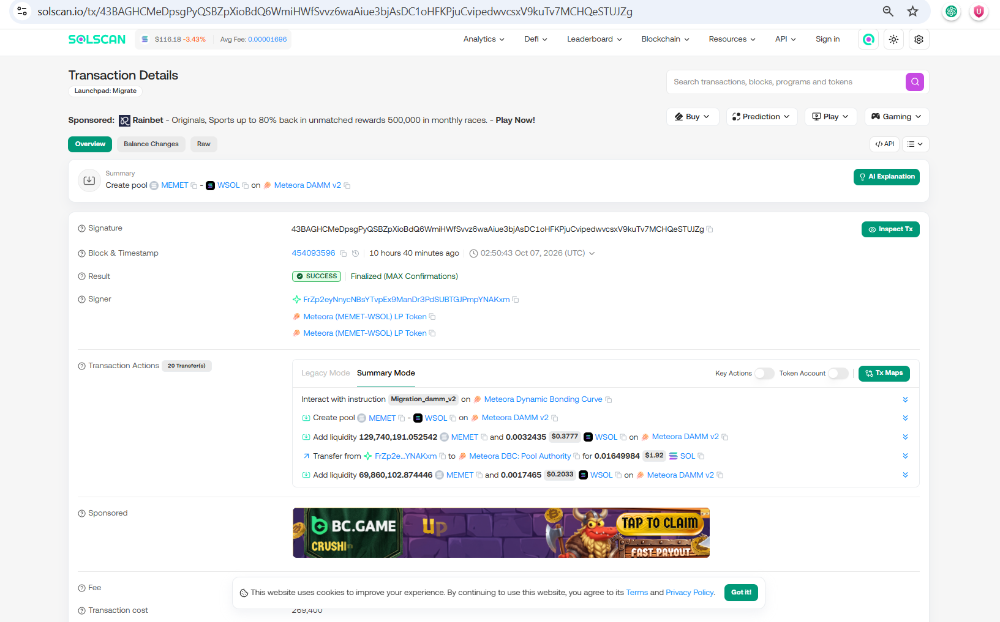

# IDART FUN

## Design the Market. Launch the Asset.

**IDART FUN** is a Solana-native programmable market launchpad built on **Meteora Dynamic Bonding Curve (DBC)**.

Creators can configure how a market launches — including the token, quote asset, Market Profile, economics mode, creator first buy, bonding path and graduation to **Meteora DAMM v2**.

---

# 🌐 Live Product

- **Website:** https://idartfun.xyz
- **Launch:** https://idartfun.xyz/launch/
- **API for Builders — Coming Soon:** https://idartfun.xyz/idart-api-for-builders/
- **X:** https://x.com/IDARTFun_Launch
- **Legacy Stocklana URL:** https://launchpad.idartdex.xyz

> **Stocklana repository notice**
>
> This repository remains the public record of the **Stocklana 2026 submission**.
>
> The original submission state is preserved in [`SUBMISSION_SNAPSHOT.md`](./SUBMISSION_SNAPSHOT.md).
>
> Features completed after the deadline are clearly identified below as **Post-Submission Progress**.

---

# ✅ Post-Submission Progress — October 2026

Since the Stocklana submission, IDART FUN has progressed from its submitted MVP into a substantially more complete launchpad with a validated browser-native lifecycle.

## Core Lifecycle Now Validated

- ✅ Solana Devnet end-to-end launch
- ✅ Solana Mainnet end-to-end launch with real SOL
- ✅ Meteora DBC config and pool creation
- ✅ Wallet-signed swaps
- ✅ Creator First Buy / Dev Buy
- ✅ Live bonding progress
- ✅ Graduation-safe `PartialFill`
- ✅ 100% bonding
- ✅ Successful **DBC → DAMM v2** migration
- ✅ Creator and partner fee accrual
- ✅ Existing-market recovery without recreating the token or pool
- ✅ Devnet and Mainnet validation archives in the Launch UI

## Product Layer Now Available

- Configurable Market Profiles
- Configurable Economics modes
- Production Mainnet market-cap targets
- Public token metadata preparation
- Website and social metadata fields
- Launch Review before transaction signing
- Mandatory safety and risk acknowledgements
- Browser wallet integration
- Mainnet transaction simulation before approval
- Discovery Markets foundation
- API for Builders preview
- Responsive desktop and mobile UI

## In Active Development

- Holder Rewards Router and holder claims
- Live Discovery Markets indexing
- Market Detail pages and analytics
- xStocks / PreStocks Quote Asset Registry
- Token-2022 compatibility filtering
- Builders API / SDK / low-code embeds
- Partner attribution and builder-originated transaction economics
- Address Lookup Table support where appropriate
- Additional wallet-security compatibility improvements

---

# 🚀 Verified Mainnet Lifecycle

IDART FUN completed and publicly verified a real Mainnet launch through the full market lifecycle:

## Mainnet Flow

`Create → Meteora DBC → Buy / Trade → 100% Bonding → DAMM v2`

## Mainnet Validation Market

| Field | Value |
|---|---|
| **Token** | Meme Tesla Club Test |
| **Symbol** | MEMET |
| **Network** | Solana Mainnet |
| **Base Mint** | `3qekQqW4YLLTjNPfaSB8AaQ9MUpTcthck4qKARM7uhSL` |
| **DBC Pool** | `2K1PYMVUChhBLPwfQ5ZAjgFwVTPXa34UKdGJkQwrrTFm` |
| **Final Bonding** | **100%** |
| **Migration** | **DAMM v2** |
| **Final State** | **Migrated** |

## Mainnet Proof

### Launch + Initial Buy TX

https://explorer.solana.com/tx/5SPwDnURxJeANhUJawmb9Zb7cifBZcMnCgTtwgCwSTJ9Xy2Sz4MeYGgTp61QscAjxKLqEhriiCgEspbgm3jMPU4R

### Base Mint

https://explorer.solana.com/address/3qekQqW4YLLTjNPfaSB8AaQ9MUpTcthck4qKARM7uhSL

### DBC Pool

https://explorer.solana.com/address/2K1PYMVUChhBLPwfQ5ZAjgFwVTPXa34UKdGJkQwrrTFm

### External Market View

https://dexscreener.com/solana/2k1pymvuchhblpwfq5zajgfwvtpxa34ukdgjkqwrrtfm

### DAMM v2 Migration TX

https://solscan.io/tx/43BAGHCMeDpsgPyQSBZpXioBdQ6WmiHWfSvvz6waAiue3bjAsDC1oHFKPjuCvipedwvcsxV9kuTv7MCHQeSTUJZg

## Migration Confirmation

- **Result:** SUCCESS
- **Status:** Finalized
- **Instruction:** `Migration_damm_v2`
- **Migration Target:** Meteora DAMM v2

The public Launch page also includes a **Verified Mainnet Validation Archive** so evaluators can inspect the completed lifecycle without initiating another Mainnet test.

---

# 🧪 Verified Devnet Lifecycle

The original Devnet validation remains part of the submission evidence.

## Devnet Identifiers

| Field | Address |
|---|---|
| **Base Mint** | `8B1cJpMukfEbK5wJYixSnkpn5eGZWPpmtrRVPbYtPXZz` |
| **DBC Pool** | `DYi5X52fshUZ3fYnex8Jbs1usFS5vT9zTAC4Tz4ooYEA` |
| **DBC Config** | `DpLXcMud36KpyC6dxZQrjHyJRetWeF3M3yf6TsR2T9sC` |

## Devnet Transactions

- **Create Config:** `5bHRDBH6eU39M9fTo6XKoFJpXpLsk54WyzU3YP9XwctEkbVU23YjSZ3Nri6ZpihsgSFdP4NYgvqVjrmo113EBxMc`
- **Create Pool:** `5pnrQCLxri2qhrZkJAb8KUEnFymtLEK53S2qzZiPKYQqJGXwF4fuzrH3meCZR2gvq5MEfqmsatcroMYj4p2fVnJv`
- **First Swap:** `5ovFiywgwuXbsZcJ3uVGLDLnkkbtXVsfYSNpDp5JYqFE7SKadUCqEcTfQGGgHZuePqDGiSQjAPotCavKX4sKQeEr`
- **Graduation-safe PartialFill:** `r8Vvmoi6g2CVJbsoEJJ76d7rNFefa4q751gr3ifLJyWuR2Toy4StftkvT4rqYrJZsbw2pyHDQ94MqTSHzUoqnvm`

## Devnet Validation Demonstrated

- Real DBC config creation
- Real token / virtual pool creation
- Real DBC swaps
- Creator / partner fee accrual
- Graduation-safe final buy using PartialFill
- 100% bonding
- Successful DAMM v2 migration

---

# 🧩 Market Design

IDART FUN is designed as a **market-design layer over Meteora**, not only a token generator.

## Market Profiles

| Profile | Starting MC | Graduation MC | Purpose |
|---|---:|---:|---|
| **Discovery** | 28 SOL | 300 SOL | Early price discovery |
| **Balanced** | 35 SOL | 350 SOL | General-purpose launches |
| **Asset Quote** | 40 SOL | 450 SOL | Quote-asset / RWA-style markets |

> These are market-cap reference parameters used by the launch configuration.
>
> They are not guarantees of liquidity, price or future value.

---

# 💰 Economics Modes

The public design keeps the total trading fee fixed at **2.50%**, while the allocation logic changes by Economics mode.

| Economics Mode | Creator | Holder Allocation | Protocol |
|---|---:|---:|---:|
| **Creator First · Standard** | 60% | 10% | 30% |
| **All Win · Balanced** | 35% | 35% | 30% |
| **Holder Rewards · Community** | 10% | 60% | 30% |

Meteora DBC provides native **Creator / Partner** fee accounting.

IDART's holder-by-holder **Rewards Router** is a separate protocol layer and remains under active development.

The public product does not claim holder claims are fully deployed until that router is live.

---

# 🪙 Creator First Buy / Dev Buy

Creators may optionally participate in the launch transaction with a first buy.

The production UI supports a configurable creator first-buy percentage and recalculates the exact Meteora quote before signing.

## Example Reference

- **Profile:** Discovery
- **Creator First Buy:** 5%
- **Approximate reference:** 1.5 SOL

The actual Meteora quote shown before wallet signing is authoritative.

---

# 📊 Quote Markets

IDART FUN is being designed to support:

- SOL
- USDC
- Compatible Solana SPL tokens
- Compatible Token-2022 assets
- xStocks / tokenized public equities
- Compatible PreStocks / pre-IPO market assets

IDART is building its own **Quote Asset Registry** to inspect mint properties on-chain and expose only supported configurations.

Transfer Hook assets require additional DAMM v2 compatibility handling and are treated separately.

---

# 🧑‍💻 API for Builders — Coming Soon

IDART FUN is being designed so third-party builders can integrate its market infrastructure into dApps and websites without receiving IDART's proprietary application code.

## Planned Integration Options

- Low-code widgets / embeds
- Documented API
- SDK / transaction builders
- Custom partner integrations
- Market discovery endpoints
- Market-state endpoints
- Launch preparation
- Swap quote / transaction preparation
- Builder attribution

## Preview

https://idartfun.xyz/idart-api-for-builders/

---

# 🔐 Security & Transaction Hardening

IDART FUN is non-custodial.

## Core Security Principles

- Users sign their own transactions
- IDART never requests seed phrases or private keys
- Mainnet transactions are simulated before broadcast
- Broadcast transactions are not automatically resent when confirmation is uncertain
- Pending transactions are reconciled before retry
- Market recovery does not recreate an existing token or pool
- Risk acknowledgements are required before on-chain launch, swap, migration and claim actions

## Production Hardening

Following wallet-security feedback, the production transaction path is also being hardened around:

- Wallet-first signing order for multi-signer transactions
- Additional signers applied after wallet signing where required
- Transaction-size monitoring
- Address Lookup Tables where appropriate
- Preserving room for wallet security instructions
- Splitting oversized / excessive-compute workflows when necessary

---

# ⭐ What Makes IDART FUN Different

IDART FUN combines:

- Configurable market design
- Meteora DBC launch infrastructure
- Multiple quote-asset strategies
- Market Profiles
- Flexible fee economics
- Creator / holder / protocol incentive design
- Creator First Buy
- Graduation-safe PartialFill
- DAMM v2 graduation
- Planned stock-token / PreStock quote markets
- Planned Builder API, SDK and embeds

The goal is not merely to launch a token.

It is to let creators and builders define **how a market launches, how it graduates and how its economics are structured**.

---

# 🏆 Stocklana 2026

IDART FUN was submitted to **Stocklana 2026** with a focus on:

- **Main Track**
- **Meteora — Best Use of DBC**
- **PreStocks — Best Use of PreStocks**

The project has continued evolving after submission.

Post-submission work is documented transparently and is **not retroactively presented as part of the original deadline build**.

---

# 📚 Documentation

- [Architecture Overview](./ARCHITECTURE.md)
- [Market Design](./MARKET_DESIGN.md)
- [Economics](./ECONOMICS.md)
- [Submission Snapshot](./SUBMISSION_SNAPSHOT.md)
- [Roadmap](./ROADMAP.md)
- [Security](./SECURITY.md)
- [Mainnet Validation](./MAINNET_VALIDATION.md)

Implementation details, proprietary application code, deployment secrets, fee-routing implementation and internal market-configuration algorithms are intentionally not published in this showcase repository.

---

# 🏗️ Project Identity

IDART FUN began inside the broader IDART ecosystem and is now being developed as an independent launchpad and programmable market-infrastructure product.

The existing **IDARTDEX** GitHub account remains the owner of this Stocklana submission repository so the original hackathon URL and provenance remain stable during judging.

Future IDART FUN development can move to a dedicated IDART FUN GitHub presence without modifying this historical Stocklana submission record.

---

# IDART FUN

## Design the Market. Launch the Asset.

© 2026 IDART FUN / IDART ecosystem.
